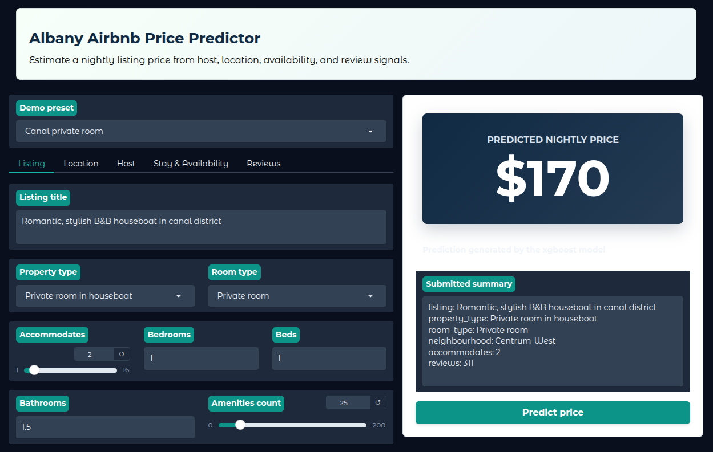
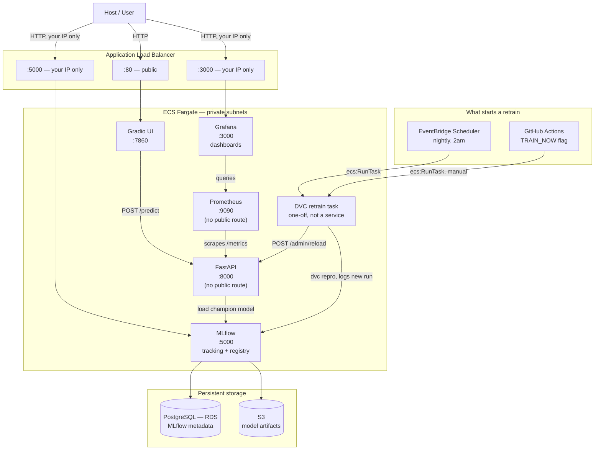

# Albany Airbnb Price Predictor

An end-to-end machine learning system that tells an Airbnb host or a hotel, or pretty much
anyone renting out a room what to charge tonight, instead of leaving it to a gut feeling.

You type in the details of a listing (location, room type, amenities, host stats,
reviews, the works), and an XGBoost model trained on real Albany, NY Airbnb data hands back a
fair nightly price. Behind that one prediction sits a full MLOps stack: a DVC training pipeline,
an MLflow model registry that tracks every model version and promotes the best one automatically,
a FastAPI service that serves predictions, a Gradio UI on top of that, and Prometheus + Grafana
watching the whole thing all running on AWS ECS Fargate, deployed by GitHub Actions. Everything
below walks through what it does, why it's built the way it is, and how to run it yourself.

---

## What this project is

Setting a price for a night's stay is a genuinely hard problem, and most hosts solve it badly.
They either copy whatever the listing down the street charges, pick a round number that "feels
right," or set a price once and never touch it again. None of that accounts for what actually
drives price in a real market: location, property type, how many people it sleeps, how good the
host's reviews are, how far out the listing is booked, and dozens of other signals that move
together in ways a person can't hold in their head all at once.

This project treats that as what it actually is a regression problem and builds a real
system around it, not just a notebook that trains a model once and gets forgotten. Feed it the
details of a listing and it returns a predicted nightly price, learned from thousands of real
Albany-area Airbnb listings: their location, their host's track record, their amenities, their
review history, all of it.

The "notebook that trains a model once" part is maybe 10% of what's here. The other 90% is
everything a model needs to actually be useful in the real world: a pipeline that validates and
retrains it on a schedule, a registry that keeps every version and only promotes a new one if it's
actually better than what's currently live, an API that serves it, a UI a non-technical host can
actually use, and monitoring that tells you if any of that stops working. That's the part most
"ML project" portfolios skip, and it's the part that actually matters once a model leaves your
laptop.

## How it helps

Get the price wrong in either direction and it costs you:

- **Price too high** and the listing sits empty. Nobody books a $220/night room next to five
  $150/night rooms that look the same on paper.
- **Price too low** and you're leaving money on every single booking, for as long as that price
  sits there unquestioned.

Either way, the host loses and they usually don't even know it's happening, because there's no
feedback loop telling them "this listing is mispriced" until occupancy quietly drops or a
competitor undercuts them.

A model that's actually trained on listings turns pricing from a guess into a data-
backed starting point. Instead of "I think $140 feels about right," a host gets "listings with
this property type, this location, and this review profile land around $132/night", a number
grounded in what similar places are actually charging and actually filling at. That means:

- **Competitive pricing without the guesswork** : the model has effectively seen thousands of
  comparable listings a single host never could.
- **Faster reaction to market conditions** : because retraining is automated (more on that
  below), the "market" the model reflects doesn't go stale the way a price someone set six months
  ago does.
- **More bookings, and better revenue per booking** : the whole point of pricing to market instead
  of pricing to a hunch.

This applies just as much to a boutique hotel or a bed-and-breakfast as it does to a single-room
Airbnb host anywhere the question is "what should this specific space cost tonight, given
everything about it and everything around it," this kind of system is the answer.



## Design of the whole system

Here's the system end to end — public traffic on the left, the automated retraining loop on the
right:



Walking through the pieces:

**Gradio is the only thing the public ever touches.** It's a plain HTML form under the hood five
tabs covering the listing, its location, the host, availability, and review history that POSTs
whatever the user fills in to FastAPI's `/predict` endpoint and shows the number that comes back.

**FastAPI never talks to the internet directly.** There's deliberately no public route to it it
only accepts traffic from inside the network (from Gradio, and from the retraining job). It loads
whichever model currently holds the `champion` alias in MLflow, caches it in memory so predictions
don't pay a network round-trip on every request, and exposes `/metrics` for Prometheus to scrape.
A `/predict` request runs through the same feature encoding the model was trained on target
encoding for neighbourhood and property type, TF-IDF on free-text fields, one-hot on room type
before the model actually sees it.

**MLflow is the source of truth for "which model is live."** Every training run gets logged here
parameters, metrics, the model itself, the fitted encoders it needs at inference time. Rather than
one static "the model," the registry tracks three aliases at once:

| Alias | Meaning |
|---|---|
| `latest_trained` | The most recent run, no judgment yet every training run gets this. |
| `champion` | Whatever's currently live in production, serving real predictions. |
| `shadow` | A model that either didn't beat the current champion, or is the previous champion, demoted kept around as a runner-up, not deleted. |

A new model only becomes `champion` if it actually beats the current one on held-out error
metrics. If it doesn't, it's kept as `shadow` instead of silently replacing something better. This
is what stops "we retrained and it got worse" from ever reaching real users.

**Retraining runs itself, from two independent triggers.** The DVC pipeline
ingest → validate (Great Expectations) → preprocess → engineer features → train → evaluate runs
automatically every night via an EventBridge schedule, and can also be triggered manually by
flipping a flag in the GitHub Actions deploy pipeline. Either way it's the same one-off task: it
resolves MLflow's and FastAPI's current addresses, runs `dvc repro`, and if a new champion just
got promoted calls FastAPI's `POST /admin/reload` so the already-running service picks it up
without needing a restart.

**Prometheus and Grafana answer "is this actually healthy right now?"** Logs tell you what
happened one line at a time; metrics tell you how many, how fast, how often. Prometheus scrapes
FastAPI's request counts, latencies, and the prediction distribution itself; Grafana turns that
into dashboards, locked down to the operator's own IP the same way MLflow's UI is.

**Everything ships through CI/CD, not by hand.** GitHub Actions authenticates to AWS via OIDC no
long-lived AWS keys sitting in a secrets store builds and pushes each service's image, registers
a new ECS task definition revision, and rolls it out with a smoke test and automatic rollback if
that smoke test fails.

Locally, the shape is identical but swaps AWS-managed pieces for containers you run yourself:
Postgres and MinIO (an S3-compatible store) stand in for RDS and S3, and everything talks over one
Docker network instead of AWS Service Connect. Same pipeline, same registry logic, same API just
running on your machine instead of in a VPC.

## Tech stack

| Layer | Tools |
|---|---|
| Modeling | XGBoost, scikit-learn, category-encoders, pandas, numpy |
| Data validation | Great Expectations |
| Pipeline orchestration | DVC |
| Experiment tracking & registry | MLflow |
| API | FastAPI, Pydantic, Uvicorn |
| UI | Gradio |
| Observability | Prometheus, Grafana (via `prometheus-fastapi-instrumentator`) |
| Datastores | PostgreSQL (MLflow backend), S3 / MinIO (artifacts) |
| Containers & orchestration | Docker, Docker Compose (local), AWS ECS Fargate (prod) |
| Cloud infrastructure | AWS (VPC, ALB, ECR, RDS, S3, Secrets Manager, EventBridge Scheduler, CloudWatch), provisioned with Terraform |
| CI/CD | GitHub Actions, authenticated to AWS via OIDC (no static credentials) |

## How to run this project

Everything below is the local Docker Compose flow the same pipeline and services that run in
AWS, just on your own machine.

**Prerequisites:** Docker, Docker Compose (the `docker compose` plugin, not the old standalone
`docker-compose`), and `make` if you want to use the shortcuts below.

**1. Clone the repo and set up your `.env` file:**

```bash
cp .env.example .env
```

Then open `.env` and fill in real values. Here's what each variable is for (the defaults in
`.env.example` already point services at each other correctly the main ones you actually need
to *choose* are the passwords):

| Variable | What it's for |
|---|---|
| `POSTGRES_USER` / `POSTGRES_PASSWORD` / `POSTGRES_DB` | MLflow's Postgres backend |
| `MINIO_ROOT_USER` / `MINIO_ROOT_PASSWORD` | Local S3-compatible artifact store |
| `BACKEND_STORE_URI` | MLflow's DB connection string, built from the Postgres values above |
| `ARTIFACTS_DESTINATION` | Where MLflow stores model artifacts |
| `AWS_ACCESS_KEY_ID` / `AWS_SECRET_ACCESS_KEY` | Reused as MinIO's access/secret key locally |
| `MLFLOW_S3_ENDPOINT_URL` | Points MLflow's S3 client at MinIO instead of real AWS |
| `MLFLOW_TRACKING_URI` | Where FastAPI and the training pipeline find MLflow |
| `API_URL` | Where Gradio finds FastAPI |
| `GRADIO_SERVER_NAME` | Interface Gradio binds to inside its container |
| `GRAFANA_ADMIN_PASSWORD` | Grafana's `admin` login |

**2. Bring the stack up:**

```bash
make dev
# same as: docker compose up --build
```

This starts Postgres, MinIO, MLflow, FastAPI, Prometheus, Grafana, and Gradio, in the right
order each service waits on the ones it depends on to report healthy before it starts. `make
down` stops it.

**3. Train a model.** The training pipeline isn't part of the default stack it's a one-off job,
not something that should run continuously:

```bash
make train
# same as: docker compose --profile train run --rm dvc-service
```

That runs the full DVC pipeline (ingest → validate → preprocess → engineer features → train →
evaluate) and registers a new model version in MLflow, promoting it to `champion` if it beats
whatever's currently live.

**4. Poke around:**

| Service | URL | What you'll find |
|---|---|---|
| Gradio UI | http://localhost:7860 | The prediction form, the easiest way to try the model |
| FastAPI docs | http://localhost:8000/docs | Interactive Swagger UI for `/predict`, `/health`, `/admin/reload` |
| MLflow | http://localhost:5000 | Every training run, its metrics, and the registry's `champion` / `shadow` / `latest_trained` aliases |
| Prometheus | http://localhost:9090 | Raw metrics FastAPI is emitting |
| Grafana | http://localhost:3000 | Dashboards built on top of those metrics (log in as `admin` with `GRAFANA_ADMIN_PASSWORD`) |

If FastAPI ever needs to pick up a newly promoted model without a restart (which the training job
does automatically), that's what `POST /admin/reload` on port 8000 is for.

**Other useful `make` targets:**

| Command | What it does |
|---|---|
| `make lint` | Runs `ruff` over `app/` and `src/` |
| `make test` | Lint, then the same unit + integration test commands CI runs |
| `make deploy` | Prints how deployment actually works it's push-to-`main`-triggers-GitHub-Actions, not a local command |
| `make destroy` | Runs `terraform destroy` against the AWS infrastructure (asks for confirmation before it does anything) |
